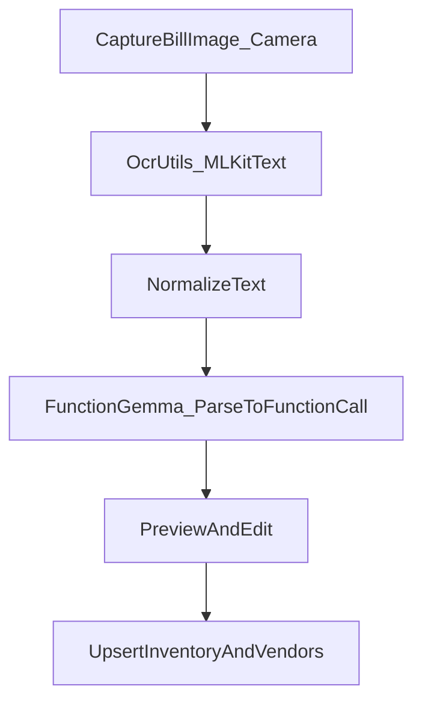

## Scope (strict)

- **In scope (core features)**:
  - **GST report export + GST invoicing**
  - **Google Drive backup/restore**
  - **Multi-device sync with cloud account**
- **In scope (required app fixes/enhancements)**:
  - Vendor click opens **vendor detail sheet**
  - Validation rules (name required, 10-digit phones, numeric-only fields, numeric keyboard)
  - Fix broken search in category/vendor selectors and inventory add flows
  - Billing: add new item when search yields no results
  - Barcode scan feedback: **beep + vibration** on each successful scan-to-cart
  - Inventory: **loose items** with price/kg and selectable portions in billing
  - Add-item dialog must be scrollable while keyboard is open
  - TTS after checkout: **“Transaction saved”**
  - Calendar UI: Material 3 date picker responsive to screen size
  - Home + Customers: no incremental counting; show numbers instantly; format currency with Indian commas
  - Privacy overlay on **all financial numbers** with biometric/device-credential unlock
  - Bill scanning to inventory import must be reliable and support **camera capture**; use **FunctionGemma**
- **Out of scope**: anything not listed above (e.g., multi-language, printer support, voice commands, AI predictions).

## Global naming requirement

- App name in UI must be **“thisizbusiness”** everywhere (no “KiranaFlow” in user-visible strings).

---

## Phase 1: Validation + input rules + search + dialog/keyboard UX

### 1.1 Mandatory product name (inventory add/edit)

- Block save if product name is blank/whitespace.
- Show inline error under the field and keep dialog open.

Likely touch points:
- [`app/src/main/java/com/kiranaflow/app/ui/screens/inventory/InventoryScreen.kt`](app/src/main/java/com/kiranaflow/app/ui/screens/inventory/InventoryScreen.kt)
- `AddItemDialog` (same file)
- Any repository-level validation (optional defense-in-depth).

### 1.2 Phone number validation (exactly 10 digits)

- For customer/vendor add/edit:
  - Strip spaces/dashes.
  - Require exactly 10 digits before enabling save/submit.
  - Show helpful error text.

Likely touch points:
- [`app/src/main/java/com/kiranaflow/app/ui/screens/parties/PartiesScreen.kt`](app/src/main/java/com/kiranaflow/app/ui/screens/parties/PartiesScreen.kt)
- [`app/src/main/java/com/kiranaflow/app/util/WhatsAppHelper.kt`](app/src/main/java/com/kiranaflow/app/util/WhatsAppHelper.kt) (ensure normalization stays consistent).

### 1.3 Numeric-only fields + numeric keyboard

- Price / cost / GST% / stock / reorder / qty / amount fields:
  - Use `KeyboardType.Number` or `KeyboardType.Decimal`
  - Apply input filter so alphabets can’t be entered (paste-safe)

Likely touch points:
- [`app/src/main/java/com/kiranaflow/app/ui/components/CommonUi.kt`](app/src/main/java/com/kiranaflow/app/ui/components/CommonUi.kt) (`KiranaInput` / shared input helpers)
- Screens: billing, inventory, parties.

### 1.4 Fix broken search in create-category + add-inventory + vendor search

- Ensure search text actually filters the list.
- Ensure the “Search” icon/affordance triggers expected focus/behavior.

Likely touch points:
- [`app/src/main/java/com/kiranaflow/app/ui/screens/inventory/InventoryScreen.kt`](app/src/main/java/com/kiranaflow/app/ui/screens/inventory/InventoryScreen.kt) (category/vendor selectors used in AddItemDialog)
- Any shared selector/search composables.

### 1.5 Add-item dialog scroll with keyboard open

- Make add/edit product dialog fully scrollable with IME visible:
  - Apply `WindowInsets.ime` padding or `Modifier.imePadding()`
  - Ensure the scroll container is inside the dialog surface (not blocked by fixed height)

Likely touch points:
- `AddItemDialog` in [`InventoryScreen.kt`](app/src/main/java/com/kiranaflow/app/ui/screens/inventory/InventoryScreen.kt)

### 1.6 Material 3 calendar responsiveness

- Adjust date picker dialog sizing for small screens.
- Ensure buttons and calendar grid remain visible without clipping.

Likely touch points:
- [`app/src/main/java/com/kiranaflow/app/ui/components/dialogs/DateRangePickerDialog.kt`](app/src/main/java/com/kiranaflow/app/ui/components/dialogs/DateRangePickerDialog.kt)

### 1.7 App name: “thisizbusiness” everywhere

- Replace user-visible references to KiranaFlow (strings, labels, titles).

Likely touch points:
- `app/src/main/res/values/strings.xml`
- App label in `AndroidManifest.xml` if needed.

---

## Phase 2: Home + Customers numbers (formatting + privacy)

### 2.1 Numbers should show instantly (no incremental reveal)

- Remove/disable animated counters.

Likely touch points:
- [`app/src/main/java/com/kiranaflow/app/ui/screens/home/HomeScreen.kt`](app/src/main/java/com/kiranaflow/app/ui/screens/home/HomeScreen.kt)
- [`app/src/main/java/com/kiranaflow/app/ui/screens/parties/PartiesScreen.kt`](app/src/main/java/com/kiranaflow/app/ui/screens/parties/PartiesScreen.kt)

### 2.2 Indian currency formatting

- Implement a reusable formatter: `₹1,23,456.78` (Indian grouping).
- Apply to revenue/expense/profit and balances.

Likely touch points:
- Utility file (e.g., `app/src/main/java/com/kiranaflow/app/util/Formatters.kt`)
- Home and parties screens.

### 2.3 Privacy overlay + biometric/device credential unlock

- Mask all financial numbers until user authenticates (BiometricPrompt with device credential fallback).
- Re-lock on app background and/or after timeout.

Likely touch points:
- `AppPrefsStore` for preference + last-unlocked timestamp
- Shared composable `PrivateNumberText(...)` used across screens.

---

## Phase 3: Billing + scanning feedback + vendor click behavior

### 3.1 Billing: add new item from search flow

- In billing item search: when no results, show “Add new item” CTA.
- After save, add newly created item to cart and keep billing flow smooth.

Likely touch points:
- [`app/src/main/java/com/kiranaflow/app/ui/screens/billing/BillingScreen.kt`](app/src/main/java/com/kiranaflow/app/ui/screens/billing/BillingScreen.kt)
- Repository insert + cart update logic.

### 3.2 Scan-to-cart feedback (sound + vibration)

- Every successful barcode added to cart must:
  - play beep sound
  - vibrate briefly

Likely touch points:
- [`app/src/main/java/com/kiranaflow/app/ui/screens/scanner/ScannerScreen.kt`](app/src/main/java/com/kiranaflow/app/ui/screens/scanner/ScannerScreen.kt)
- Ensure `res/raw/beep.mp3` is used reliably.

### 3.3 “Transaction saved” voice after checkout

- Ensure TTS triggers after transaction commit and only once.

Likely touch points:
- `BillingScreen.kt` checkout completion path.

### 3.4 Vendor click → Vendor detail sheet

- Click vendor row opens vendor detail sheet:
  - vendor info
  - transaction history
  - pay / record purchase

Likely touch points:
- [`app/src/main/java/com/kiranaflow/app/ui/screens/vendors/VendorsScreen.kt`](app/src/main/java/com/kiranaflow/app/ui/screens/vendors/VendorsScreen.kt)
- Reuse patterns from customer detail sheet.

---

## Phase 4: Loose items (weight-based)

### Data model + migration

- Extend item model to support:
  - `itemType = PACKED | LOOSE`
  - `pricePerKg` (for loose)
  - (optional) default portion list
- Add Room migration.

### Inventory UI

- In add/edit item:
  - Choose type (Packed/Loose)
  - If Loose: enter **price per KG**

### Billing UI

- For loose item cart rows:
  - portion selector: 250g, 500g, 1kg, 2kg, custom grams
  - computed price reflects selected weight.

---

## Phase 5: Bill scanning to inventory import using FunctionGemma

### Current baseline (existing)

- Inventory screen uses OCR + heuristic parser today:
  - OCR: `OcrUtils.ocrFromUri(...)`
  - Parse: `BillOcrParser.parse(text)`
  - Import: `repo.processVendorBill(parsed)`

Relevant code:
- [`InventoryScreen.kt`](app/src/main/java/com/kiranaflow/app/ui/screens/inventory/InventoryScreen.kt) (Scan Bill flow)
- `app/src/main/java/com/kiranaflow/app/util/OcrUtils.kt`
- `app/src/main/java/com/kiranaflow/app/util/BillOcrParser.kt`

### Target architecture

### FunctionGemma integration approach

- Use FunctionGemma for **structured extraction** (function calling) from OCR text.
- Follow official docs for tool-calling formatting/best practices:
  - Overview: `https://blog.google/technology/developers/functiongemma/`
  - Model: `https://huggingface.co/google/functiongemma-270m-it`
  - Unsloth docs: `https://docs.unsloth.ai/models/functiongemma`
  - Fine-tuning guide: `https://docs.unsloth.ai/models/functiongemma#fine-tuning-functiongemma`
  - Formatting/best practices: `https://ai.google.dev/gemma/docs/functiongemma/formatting-and-best-practices`

### MVP extraction schema (first pass)

- Function: `extractBillItems(ocrText) -> { invoiceMeta, items[] }`
- Each item includes:
  - `name`
  - `qty` + `unit`
  - `unitPrice` + `lineTotal`
  - `hsn` (optional)
  - `gstPercent` (optional)
  - `confidence`

### UX requirements

- Scan bill supports **camera capture** directly.
- Show results in preview list with edit controls.
- Import only after user confirms.

### Quality strategy

- Start prompt-only; log failures and collect anonymized sample OCR text (user-opt-in).
- If needed, fine-tune FunctionGemma later using Unsloth.

---

## Phase 6: GST reports export + GST invoicing

### Report exports (minimum)

- GSTR-1 style outward supply summary
- GSTR-3B summary
- HSN-wise summary (requires item HSN or vendor bill extraction)
- Tax breakup: CGST/SGST/IGST where applicable

### Invoice generation

- Generate GST invoice PDFs from transactions (sales):
  - shop details + GSTIN
  - invoice number/date
  - line items + HSN + GST%
  - totals and tax breakdown

### Export formats

- PDF
- CSV (at minimum)

---

## Phase 7: Google Drive backup/restore

- Google sign-in + Drive scope
- Create encrypted backups
- Upload to app folder in Drive
- List backups + restore flow
- Optional scheduled backups via WorkManager

---

## Phase 8: Multi-device sync with cloud account

- Supabase Auth (user identity)
- Extend existing outbox-based sync:
  - user scoping
  - device registration
  - pull remote ops + apply locally
  - conflict policy (start with last-write-wins; expand if needed)
- UI:
  - sync status
  - manual sync
  - error/retry

