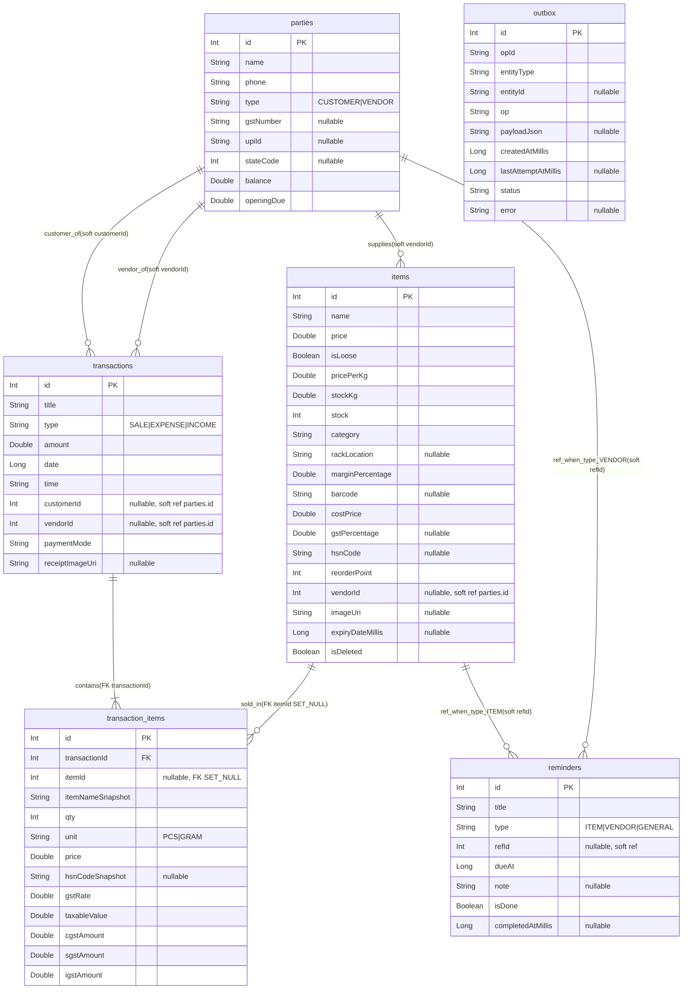

# Entity Relationship Diagram (ERD) — thisizbusiness

This app stores data in two places:

- **Room (SQLite)**: relational transactional data (tables below)
- **Android DataStore (Preferences)**: key-value app settings/preferences

---

## Room database

**Database name:** `kirana_database`  
**Room database class:** `app/src/main/java/com/kiranaflow/app/data/local/KiranaDatabase.kt`

### ER Diagram (Room tables)

### Tables involved (Room)

All Room entities are defined in `app/src/main/java/com/kiranaflow/app/data/local/Entities.kt`:

- `items`
- `parties`
- `transactions`
- `transaction_items`
- `reminders`
- `outbox`

### Table schemas (Room)

#### `parties` (customers + vendors)

| Column | Type | Constraints | Stored meaning |
|---|---|---|---|
| `id` | Int | PK, auto-increment | Party identifier |
| `name` | String | NOT NULL | Party name |
| `phone` | String | NOT NULL | Phone number |
| `type` | String | NOT NULL | `"CUSTOMER"` or `"VENDOR"` |
| `gstNumber` | String? | NULLABLE | GSTIN (if known) |
| `upiId` | String? | NULLABLE | UPI VPA |
| `stateCode` | Int? | NULLABLE | 2-digit GST state code |
| `balance` | Double | NOT NULL (default 0.0) | Running balance |
| `openingDue` | Double | NOT NULL (default 0.0) | Opening due |

#### `items` (inventory)

| Column | Type | Constraints | Stored meaning |
|---|---|---|---|
| `id` | Int | PK, auto-increment | Item identifier |
| `name` | String | NOT NULL | Item name |
| `price` | Double | NOT NULL | Selling price |
| `isLoose` | Boolean | NOT NULL (default false) | Loose item flag |
| `pricePerKg` | Double | NOT NULL (default 0.0) | Price per kg (loose) |
| `stockKg` | Double | NOT NULL (default 0.0) | Stock in kg (loose) |
| `stock` | Int | NOT NULL | Stock count (non-loose) |
| `category` | String | NOT NULL | Category |
| `rackLocation` | String? | NULLABLE | Rack/location |
| `marginPercentage` | Double | NOT NULL | Margin % |
| `barcode` | String? | NULLABLE | Barcode |
| `costPrice` | Double | NOT NULL | Cost price |
| `gstPercentage` | Double? | NULLABLE | GST rate % |
| `hsnCode` | String? | NULLABLE | HSN/SAC code |
| `reorderPoint` | Int | NOT NULL | Reorder threshold |
| `vendorId` | Int? | NULLABLE (soft ref) | Intended `parties.id` (vendor) |
| `imageUri` | String? | NULLABLE | Local URI to item image |
| `expiryDateMillis` | Long? | NULLABLE | Expiry date (epoch millis) |
| `isDeleted` | Boolean | NOT NULL (default false) | Soft delete flag |

#### `transactions` (sale/expense/income header)

| Column | Type | Constraints | Stored meaning |
|---|---|---|---|
| `id` | Int | PK, auto-increment | Transaction identifier |
| `title` | String | NOT NULL | Title/description |
| `type` | String | NOT NULL | `"SALE"`, `"EXPENSE"`, `"INCOME"` |
| `amount` | Double | NOT NULL | Total amount |
| `date` | Long | NOT NULL | Timestamp (epoch millis) |
| `time` | String | NOT NULL | Display time string |
| `customerId` | Int? | NULLABLE (soft ref) | Intended `parties.id` (customer) |
| `vendorId` | Int? | NULLABLE (soft ref) | Intended `parties.id` (vendor) |
| `paymentMode` | String | NOT NULL | Payment mode |
| `receiptImageUri` | String? | NULLABLE | Local URI to receipt image |

#### `transaction_items` (line items)

| Column | Type | Constraints | Stored meaning |
|---|---|---|---|
| `id` | Int | PK, auto-increment | Line identifier |
| `transactionId` | Int | NOT NULL, FK | `transactions.id` (CASCADE on delete) |
| `itemId` | Int? | NULLABLE, FK | `items.id` (SET NULL on delete) |
| `itemNameSnapshot` | String | NOT NULL | Item name snapshot |
| `qty` | Int | NOT NULL | Quantity (or grams) |
| `unit` | String | NOT NULL (default `"PCS"`) | `"PCS"` or `"GRAM"` |
| `price` | Double | NOT NULL | Selling price at time |
| `hsnCodeSnapshot` | String? | NULLABLE | HSN snapshot |
| `gstRate` | Double | NOT NULL (default 0.0) | GST rate snapshot |
| `taxableValue` | Double | NOT NULL (default 0.0) | Taxable value snapshot |
| `cgstAmount` | Double | NOT NULL (default 0.0) | CGST snapshot |
| `sgstAmount` | Double | NOT NULL (default 0.0) | SGST snapshot |
| `igstAmount` | Double | NOT NULL (default 0.0) | IGST snapshot |

#### `reminders`

| Column | Type | Constraints | Stored meaning |
|---|---|---|---|
| `id` | Int | PK, auto-increment | Reminder identifier |
| `title` | String | NOT NULL | Reminder title |
| `type` | String | NOT NULL | `"ITEM"`, `"VENDOR"`, `"GENERAL"` |
| `refId` | Int? | NULLABLE (soft ref) | Interpreted by `type` |
| `dueAt` | Long | NOT NULL | Due timestamp (epoch millis) |
| `note` | String? | NULLABLE | Optional note |
| `isDone` | Boolean | NOT NULL (default false) | Completion flag |
| `completedAtMillis` | Long? | NULLABLE | Completion timestamp |

#### `outbox` (offline sync queue)

| Column | Type | Constraints | Stored meaning |
|---|---|---|---|
| `id` | Int | PK, auto-increment | Outbox row identifier |
| `opId` | String | NOT NULL (default UUID) | Operation id |
| `entityType` | String | NOT NULL | Entity type discriminator |
| `entityId` | String? | NULLABLE | Entity id (string) |
| `op` | String | NOT NULL | `"UPSERT"` or `"DELETE"` |
| `payloadJson` | String? | NULLABLE | Serialized payload |
| `createdAtMillis` | Long | NOT NULL (default now) | Created time |
| `lastAttemptAtMillis` | Long? | NULLABLE | Last attempt time |
| `status` | String | NOT NULL (default `"PENDING"`) | `"PENDING"`, `"DONE"`, `"FAILED"` |
| `error` | String? | NULLABLE | Error details |

### How data is stored and linked (Room)

#### `items`
Stores inventory. Important columns:
- `id` (PK)
- `vendorId` (nullable **soft reference** to `parties.id` — not enforced by Room FK)
- `isDeleted` is a **soft delete** flag (DAO queries filter on it)

#### `parties`
Stores both customers and vendors (single table) using:
- `type`: `"CUSTOMER"` or `"VENDOR"`
- `gstNumber`, `stateCode`: optional GST reporting fields
- `upiId`: optional UPI VPA for payment redirects
- `balance`, `openingDue`: running balance fields used by the app logic

#### `transactions`
Stores SALE/EXPENSE/INCOME headers. Links are **soft references**:
- `customerId` (nullable) → `parties.id`
- `vendorId` (nullable) → `parties.id`

Other notable storage:
- `date`: epoch millis (sorting/filtering)
- `time`: formatted display time
- `receiptImageUri`: optional **local URI** for receipt capture (image itself is not stored in DB)

#### `transaction_items`
Stores transaction line-items.

**Hard foreign keys (enforced by Room):**
- `transactionId` → `transactions.id` (**ON DELETE CASCADE**)
- `itemId` → `items.id` (**ON DELETE SET NULL** to preserve history)

**Why snapshots exist:**
- `itemNameSnapshot` preserves the line item name even if the `items` row changes/deletes
- GST-related snapshots (`hsnCodeSnapshot`, `gstRate`, `taxableValue`, `cgstAmount`, `sgstAmount`, `igstAmount`) preserve/export reviewed values

**Quantity semantics:**
- `qty` is an `Int`
- `unit` is `"PCS"` or `"GRAM"` (loose-items billing uses grams)

#### `reminders`
Stores reminders/tasks. `refId` is a **soft reference**:
- when `type = "ITEM"`: `refId` is intended to point to `items.id`
- when `type = "VENDOR"`: `refId` is intended to point to `parties.id`
- when `type = "GENERAL"`: `refId` is typically null

There is no DB-level foreign key here; the app interprets `refId` based on `type`.

#### `outbox`
Stores an offline-first “queue” of local changes intended for future cloud sync. It is **polymorphic**:
- `entityType`: e.g. `ITEM`, `PARTY`, `TRANSACTION`, `TRANSACTION_ITEM`, `REMINDER`
- `entityId`: stored as string (supports int IDs today + future server IDs)
- `payloadJson`: serialized snapshot of the operation/entity (when applicable)

No foreign keys are enforced because `outbox` can refer to multiple entity types.

---

### Relationship summary (Room)

| Relationship | Cardinality | Enforced by DB? | Linking columns |
|---|---:|---:|---|
| `transactions` → `transaction_items` | 1 → many | Yes | `transaction_items.transactionId` FK (CASCADE) |
| `items` → `transaction_items` | 1 → many | Yes | `transaction_items.itemId` FK (SET NULL) |
| `parties` → `items` (vendor) | 1 → many | No (soft) | `items.vendorId` |
| `parties` → `transactions` (customer) | 1 → many | No (soft) | `transactions.customerId` |
| `parties` → `transactions` (vendor) | 1 → many | No (soft) | `transactions.vendorId` |
| `items` → `reminders` | 1 → many | No (soft/conditional) | `reminders.refId` when `reminders.type="ITEM"` |
| `parties` → `reminders` | 1 → many | No (soft/conditional) | `reminders.refId` when `reminders.type="VENDOR"` |
| `outbox` → (any) | many → 0/1 | No (polymorphic) | `outbox.entityType` + `outbox.entityId` |

---

## DataStore (Preferences)

### `shop_settings` (business profile + templates)

**Store implementation:** `app/src/main/java/com/kiranaflow/app/data/local/ShopSettingsStore.kt`

Keys:
- `shop_name` (String)
- `owner_name` (String)
- `upi_id` (String)
- `upi_payee_name` (String)
- `whatsapp_reminder_message` (String)
- `receipt_template` (String)
- `gstin` (String)
- `legal_name` (String)
- `address` (String)
- `state_code` (Int)

### `app_prefs` (device/app state)

**Store implementation:** `app/src/main/java/com/kiranaflow/app/data/local/AppPrefsStore.kt`

Keys:
- `demo_mode_enabled` (Boolean)
- `demo_reset_requested` (Boolean)
- `device_id` (String)
- `last_sync_attempt_at_millis` (Long)
- `last_sync_message` (String)
- `last_backup_at_millis` (Long)
- `privacy_unlocked_until_millis` (Long)

